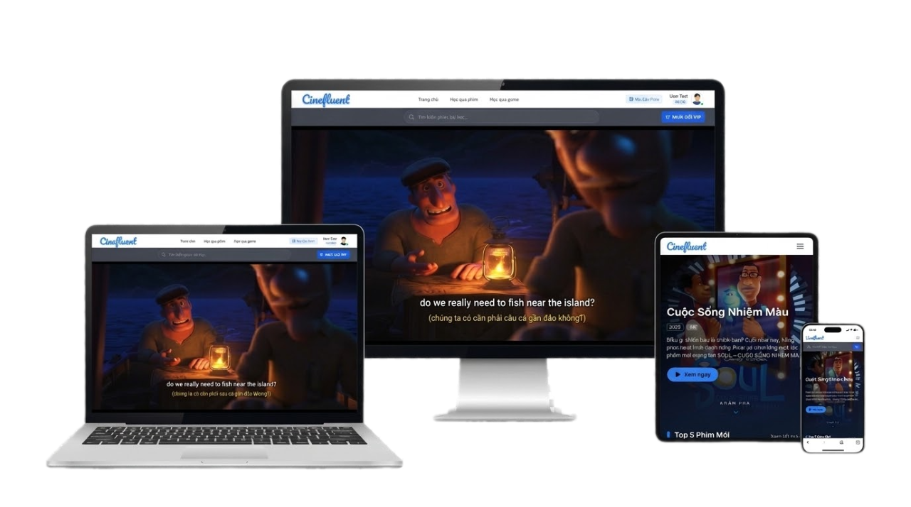

  

  <h1>CineFluent</h1>
  
Learn English through movies, bilingual subtitles and adaptive AI.

  
  
  
  

Overview

CineFluent converts movie subtitles into contextual English lessons. Learners can watch, look up vocabulary, practise listening and speaking, and receive exercises adapted to their learning history.

Core Features

Module

What learners can do

Main technology

Movie learning

Stream movies and track viewing progress

Google Drive, Nginx, HLS

Smart subtitles

View bilingual subtitles and look up words or phrases by timestamp

SRT/VTT, Web Worker

Practice

Create flashcards, complete dictation and practise speaking with shadowing

Next.js, Flask, MySQL

Adaptive learning

Receive grammar exercises based on current mastery

XLM-RoBERTa, DKT-LSTM, ONNX

AI assistant

Ask questions grounded in CineFluent learning data

Gemini, Product-RAG

Video calls

Practise one-to-one speaking in real time

WebRTC, PeerJS, Socket.IO

Learning Flow

flowchart TD
    A[Watch a movie] --> B[Interact with bilingual subtitles]
    B --> C[Save words and complete exercises]
    C --> D[DKT updates learner mastery]
    D --> E[System selects the next suitable exercise]
    E --> A

AI Pipeline

Component

Responsibility

XLM-RoBERTa

Classifies subtitle sentences into 12 English tense categories

spaCy

Detects verbs and creates distractors for cloze exercises

DKT-LSTM

Predicts learner mastery from previous answers

Gemini + Product-RAG

Provides context-aware learning assistance

System Architecture

flowchart TD
    U[Web client] --> N[Nginx gateway]
    N --> F[Next.js frontend]
    N --> B[Flask API and Socket.IO]
    B --> D[(MySQL)]
    B --> M[Google Drive and Cloudinary]
    B --> A[Grammar AI, DKT and RAG]
    U <--> W[WebRTC peer]

Technology

Layer

Stack

Frontend

Next.js 16, React 19, TypeScript, Tailwind CSS, Ant Design

Backend

Python 3.11, Flask, SQLAlchemy, JWT, Socket.IO

Data

MySQL 8, JSON/Qdrant vector store

AI

XLM-RoBERTa, spaCy, DKT-LSTM, ONNX Runtime, Gemini, Product-RAG

Media

Google Drive, Cloudinary, Nginx, HLS, SRT/VTT

DevOps

Docker Compose, GitHub Actions, AWS EC2/VPS

<strong>Run with Docker Compose</strong>

Requirements

Git, Docker and Docker Compose

Google OAuth client and Drive service account

Gemini, TMDB and Cloudinary credentials

Start

git clone https://github.com/MinLD/CineFluent-Project.git
cd CineFluent-Project
docker compose up --build -d
docker compose exec backend flask db upgrade
docker compose exec backend flask seed --with-admin

Service

Address

Application

http://localhost

Frontend

http://localhost:3000

Backend

http://localhost:5000

MySQL

localhost:3306

<strong>Required environment variables</strong>

MYSQL_ROOT_PASSWORD=
MYSQL_DATABASE=cinefluent
DATABASE_URL=
SECRET_KEY=
GOOGLE_CLIENT_ID=
NEXT_PUBLIC_GOOGLE_CLIENT_ID=
CLOUDINARY_CLOUD_NAME=
CLOUDINARY_API_KEY=
CLOUDINARY_API_SECRET=
GEMINI_API_KEY=
TMDB_API_KEY=

Place the Google service-account file at:

server/be_flask_cinefluent/app/utils/service-account.json

Never commit credentials, service-account files or private media URLs.

Author

Do Dang Minh Luan — Full-stack DeveloperGitHub profile · Project repository
