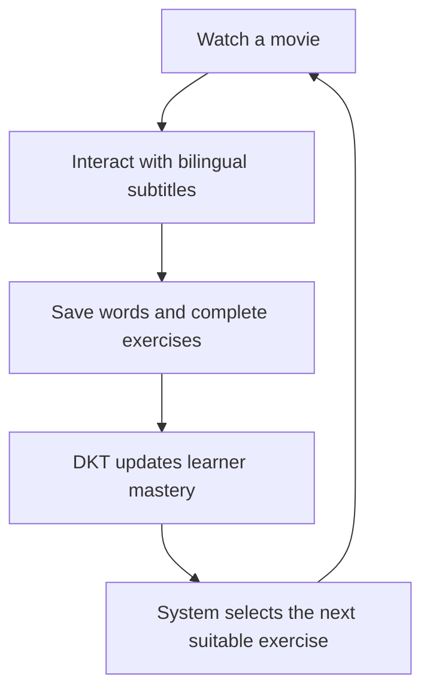
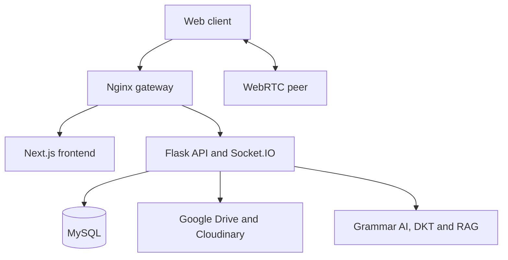

<div align="center">
  

  <h1>CineFluent</h1>
  <p>Learn English through movies, bilingual subtitles and adaptive AI.</p>

  
  
  
  
</div>

## Overview

CineFluent is a full-stack English-learning platform that turns movies and bilingual subtitles into contextual lessons. Learners can watch movies, look up words and phrases directly from subtitles, create flashcards, practise vocabulary, complete listening dictation, train pronunciation through shadowing, and track their learning progress.

The frontend is built with Next.js, TypeScript and Tailwind CSS, while the REST API uses Python and Flask. MySQL and SQLAlchemy manage users, movies, subtitles, progress and flashcards, with JWT/RBAC for authentication and authorization. Movie sources are stored on Google Drive and delivered through Nginx using HLS and X-Accel-Redirect.

## Core Features

| Module | What learners can do | Implementation |
| --- | --- | --- |
| Movie learning | Watch movies and continue from saved viewing progress | Google Drive sources, Nginx, HLS, X-Accel-Redirect |
| Smart subtitles | View bilingual subtitles and look up words or phrases at the current timestamp | SRT/VTT parsing, Web Worker, binary search |
| Vocabulary | Save subtitle vocabulary, create flashcards and complete contextual exercises | Next.js, Flask, MySQL/SQLAlchemy |
| Listening and speaking | Complete dictation exercises and practise pronunciation through shadowing | Timestamp-synchronized subtitles and audio |
| Adaptive grammar | Receive exercises selected according to the learner's current mastery | XLM-RoBERTa, spaCy, DKT-LSTM, ONNX Runtime |
| AI assistant | Ask learning and product questions using answers grounded in CineFluent data | Gemini 2.5 Flash, Product-RAG, JSON/Qdrant |
| Video calls | Practise one-to-one speaking through peer-to-peer audio and video | WebRTC/PeerJS, Socket.IO signaling, rooms, offer/answer/ICE |
| User management | Manage accounts, roles, movies, subtitles, reports and learning history | JWT/RBAC, Flask REST API, MySQL |

## Technical Highlights

| Highlight | How it works |
| --- | --- |
| Adaptive playback | The player looks ahead in the subtitle timeline and triggers a suitable grammar exercise when DKT predicts low mastery |
| Efficient subtitle processing | AI metadata is injected into VTT files, parsed in a Web Worker and searched in `O(log n)` time |
| Context-aware assistance | Gemini uses Product-RAG so answers are grounded in CineFluent's product and learning knowledge |
| Protected media delivery | Flask authorizes Google Drive media requests while Nginx serves the stream through X-Accel-Redirect |

## Learning Flow



## AI Pipeline

| Component | Responsibility |
| --- | --- |
| XLM-RoBERTa | Classifies subtitle sentences into 12 English tense categories |
| spaCy | Detects verbs and creates distractors for cloze exercises |
| DKT-LSTM | Predicts learner mastery from previous answers |
| Gemini + Product-RAG | Provides context-aware learning assistance |

## System Architecture



## Technology

| Layer | Stack |
| --- | --- |
| Frontend | Next.js 16, React 19, TypeScript, Tailwind CSS, Ant Design |
| Backend | Python 3.11, Flask, SQLAlchemy, JWT, Socket.IO |
| Data | MySQL 8, JSON/Qdrant vector store |
| AI | XLM-RoBERTa, spaCy, DKT-LSTM, ONNX Runtime, Gemini, Product-RAG |
| Media | Google Drive, Cloudinary, Nginx, HLS, SRT/VTT |
| DevOps | Docker Compose, GitHub Actions, AWS EC2/VPS |

<details>
<summary><strong>Run with Docker Compose</strong></summary>

### Requirements

- Git, Docker and Docker Compose
- Google OAuth client and Drive service account
- Gemini, TMDB and Cloudinary credentials

### Start

```bash
git clone https://github.com/MinLD/CineFluent-Project.git
cd CineFluent-Project
docker compose up --build -d
docker compose exec backend flask db upgrade
docker compose exec backend flask seed --with-admin
```

| Service | Address |
| --- | --- |
| Application | `http://localhost` |
| Frontend | `http://localhost:3000` |
| Backend | `http://localhost:5000` |
| MySQL | `localhost:3306` |

</details>

<details>
<summary><strong>Required environment variables</strong></summary>

```dotenv
MYSQL_ROOT_PASSWORD=
MYSQL_DATABASE=cinefluent
DATABASE_URL=
SECRET_KEY=
GOOGLE_CLIENT_ID=
NEXT_PUBLIC_GOOGLE_CLIENT_ID=
CLOUDINARY_CLOUD_NAME=
CLOUDINARY_API_KEY=
CLOUDINARY_API_SECRET=
GEMINI_API_KEY=
TMDB_API_KEY=
```

Place the Google service-account file at:

```text
server/be_flask_cinefluent/app/utils/service-account.json
```

Never commit credentials, service-account files or private media URLs.

</details>

## Author

**Do Dang Minh Luan** — Full-stack Developer  
[GitHub profile](https://github.com/MinLD) · [Project repository](https://github.com/MinLD/CineFluent-Project)

What learners can do
[README(6).md](https://github.com/user-attachments/files/30593676/README.6.md)

Main technology

Movie learning

Stream movies and track viewing progress

Google Drive, Nginx, HLS

Smart subtitles

View bilingual subtitles and look up words or phrases by timestamp

SRT/VTT, Web Worker

Practice

Create flashcards, complete dictation and practise speaking with shadowing

Next.js, Flask, MySQL

Adaptive learning

Receive grammar exercises based on current mastery

XLM-RoBERTa, DKT-LSTM, ONNX

AI assistant

Ask questions grounded in CineFluent learning data

Gemini, Product-RAG

Video calls

Practise one-to-one speaking in real time

WebRTC, PeerJS, Socket.IO

Learning Flow

flowchart TD
    A[Watch a movie] --> B[Interact with bilingual subtitles]
    B --> C[Save words and complete exercises]
    C --> D[DKT updates learner mastery]
    D --> E[System selects the next suitable exercise]
    E --> A

AI Pipeline

Component

Responsibility

XLM-RoBERTa

Classifies subtitle sentences into 12 English tense categories

spaCy

Detects verbs and creates distractors for cloze exercises

DKT-LSTM

Predicts learner mastery from previous answers

Gemini + Product-RAG

Provides context-aware learning assistance

System Architecture

flowchart TD
    U[Web client] --> N[Nginx gateway]
    N --> F[Next.js frontend]
    N --> B[Flask API and Socket.IO]
    B --> D[(MySQL)]
    B --> M[Google Drive and Cloudinary]
    B --> A[Grammar AI, DKT and RAG]
    U <--> W[WebRTC peer]

Technology

Layer

Stack

Frontend

Next.js 16, React 19, TypeScript, Tailwind CSS, Ant Design

Backend

Python 3.11, Flask, SQLAlchemy, JWT, Socket.IO

Data

MySQL 8, JSON/Qdrant vector store

AI

XLM-RoBERTa, spaCy, DKT-LSTM, ONNX Runtime, Gemini, Product-RAG

Media

Google Drive, Cloudinary, Nginx, HLS, SRT/VTT

DevOps

Docker Compose, GitHub Actions, AWS EC2/VPS

<details>
<summary><strong>Run with Docker Compose</strong></summary>

Requirements

Git, Docker and Docker Compose

Google OAuth client and Drive service account

Gemini, TMDB and Cloudinary credentials

Start

git clone https://github.com/MinLD/CineFluent-Project.git
cd CineFluent-Project
docker compose up --build -d
docker compose exec backend flask db upgrade
docker compose exec backend flask seed --with-admin

Service

Address

Application

http://localhost

Frontend

http://localhost:3000

Backend

http://localhost:5000

MySQL

localhost:3306

</details>

<details>
<summary><strong>Required environment variables</strong></summary>

MYSQL_ROOT_PASSWORD=
MYSQL_DATABASE=cinefluent
DATABASE_URL=
SECRET_KEY=
GOOGLE_CLIENT_ID=
NEXT_PUBLIC_GOOGLE_CLIENT_ID=
CLOUDINARY_CLOUD_NAME=
CLOUDINARY_API_KEY=
CLOUDINARY_API_SECRET=
GEMINI_API_KEY=
TMDB_API_KEY=

Place the Google service-account file at:

server/be_flask_cinefluent/app/utils/service-account.json

Never commit credentials, service-account files or private media URLs.

</details>

Author

Do Dang Minh Luan — Full-stack DeveloperGitHub profile · Project repository
